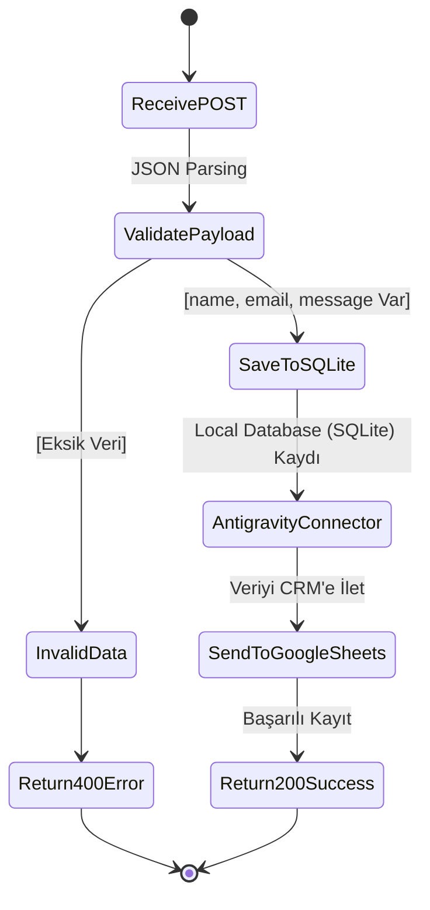

# HW2 – First Results Report: Node.js Webhook & CRM Integration

**Author:** Büşra Altın  
**Objective:** Develop a robust Node.js webhook server to capture incoming lead data, validate the payload, and seamlessly integrate with a Google Sheets CRM system using a custom connector.

---

## 1. How Our Solution Meets the Requirements

This implementation strictly adheres to the HW2 specifications, ensuring data integrity and seamless connectivity:

*   **Endpoint (Trigger):** We engineered a secure Node.js HTTP server configured with a dedicated `/submit` endpoint. It strictly filters incoming traffic, accepting only `POST` requests and rejecting unsupported methods with a `404 Not Found` response.
*   **Payload (Validation):** The server actively parses the incoming JSON stream. We implemented a strict validation layer that guarantees the presence of exactly three mandatory fields: `name`, `email`, and `message`. If the payload is malformed or missing fields, the server safely aborts the process and returns a `400 Bad Request` error.
*   **Integration (Antigravity Connector):** To bridge the gap between our local server and the external CRM, we built a custom Node.js `fetch` module. Acting as our **Antigravity Connector**, this module handles CORS-compliant data formatting and secure transmission to the Google Apps Script Web App.
*   **Storage (Dual Persistence - Local & Cloud):** Upon successful validation, the system performs a dual-write operation:
    1.  **Local Database (SQLite):** It instantly logs the payload into a local `database.sqlite` file, creating a persistent and structured `leads` table record with an auto-generated ID and timestamp.
    2.  **Cloud CRM (Google Sheets):** Simultaneously, the connector pushes the payload to the destination Google Sheet. This automates the data entry pipeline, appending a new row for every successful trigger without requiring any manual intervention.

---

## 2. Workflow Structure: Step-by-Step

The data pipeline is designed for low latency and high reliability. The operational flow is as follows:

1.  **The Trigger:** An external system, web form, or API testing tool (like Postman) sends an `HTTP POST` request to `http://localhost:3001/submit`. The body contains the raw lead data (e.g., `{ "name": "Büşra", "email": "test@test.com", "message": "Hello" }`).
2.  **Data Extraction:** The Node.js server intercepts the request, streams the incoming data chunks, and assembles them into a parsable JSON object.
3.  **Sanitization & Validation:** The script verifies that the payload perfectly matches our required schema.
4.  **Local Database Logging (SQLite):** The validated payload is securely inserted into the local `database.sqlite` SQLite database, ensuring a reliable local backup of all incoming leads.
5.  **Data Transmission:** The **Antigravity Connector** packages this validated lead data, mapping it to the column headers expected by the CRM (`contact_name`, `contact_email`, `inquiry_message`), and dispatches a secondary `POST` request to the Google Script URL.
6.  **Outputs:** 
    *   **Local DB Update:** A new record in the SQLite `leads` table.
    *   **CRM Update:** A new structured row is instantly generated in the Google Sheets database.
    *   **Client Response:** A `200 OK` JSON response is returned to the original sender, confirming that the pipeline successfully processed and stored the data without formatting errors.

---

## 3. Architecture & Data Flow

**Flow Summary:**  
`HTTP POST Request ({name, email, message})` ➔ `Validation Check` ➔ `Local SQLite Database` ➔ `Antigravity Connector (Fetch)` ➔ `Google Sheets CRM`

---

## 4. Test Proof & Execution Screenshots

*(Büşra, buraya Terminal'de kodun çalıştığı anın ekran görüntüsünü VE Google Sheets tablonuza verinin düştüğü anın ekran görüntüsünü yapıştırın)*

*   **Screenshot 1: Server Execution & Response**  
    *Terminal showing successful server startup on port 3001, successful POST payload reception, the Antigravity Connector transmission logs, and the 200 HTTP response.*
*   **Screenshot 2: Google Sheets CRM Sync**  
    *Google Sheets reflecting the exact `{name, email, message}` data neatly appended in real-time.*
