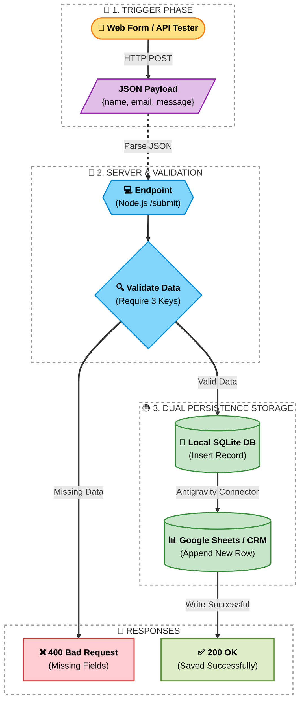

# HW2 Workflow Architecture (Styled Flowchart - English)

(You can copy the code below and paste it into https://mermaid.live to get the beautiful colored diagram for your Word report!)

```mermaid
flowchart TD
    %% Custom Styles - Kutuların yazıları simsiyah ve kalın olacak
    classDef trigger fill:#FFE082,stroke:#F57F17,stroke-width:2px,color:#000000,rx:10,ry:10
    classDef payload fill:#E1BEE7,stroke:#8E24AA,stroke-width:2px,color:#000000,rx:5,ry:5
    classDef server fill:#81D4FA,stroke:#0288D1,stroke-width:2px,color:#000000,rx:10,ry:10
    classDef database fill:#C8E6C9,stroke:#388E3C,stroke-width:2px,color:#000000,rx:5,ry:5
    classDef alert fill:#FFCDD2,stroke:#D32F2F,stroke-width:2px,color:#000000
    classDef success fill:#DCEDC8,stroke:#558B2F,stroke-width:2px,color:#000000

    subgraph Step_1 ["🔵 1. TRIGGER PHASE"]
        direction TB
        Client([<b>👤 Web Form / API Tester</b>]):::trigger
        Payload[/"<b>JSON Payload</b><br/>{name, email, message}"/]:::payload
        
        Client =="HTTP POST"==> Payload
    end

    subgraph Step_2 ["🚀 2. SERVER & VALIDATION"]
        direction TB
        Endpoint{{"<b>💻 Endpoint</b><br/>(Node.js /submit)"}}:::server
        Validate{"<b>🔍 Validate Data</b><br/>(Require 3 Keys)"}:::server
        
        Payload -. "Parse JSON" .-> Endpoint
        Endpoint ==> Validate
    end

    subgraph Step_3 ["🟢 3. DUAL PERSISTENCE STORAGE"]
        direction TB
        LocalDb[("<b>💾 Local SQLite DB</b><br>(Insert Record)")]:::database
        GoogleDb[("<b>📊 Google Sheets / CRM</b><br>(Append New Row)")]:::database
        
        LocalDb == "Antigravity Connector" ==> GoogleDb
    end

    subgraph Responses ["📨 RESPONSES"]
        Error["<b>❌ 400 Bad Request</b><br>(Missing Fields)"]:::alert
        Ok["<b>✅ 200 OK</b><br>(Saved Successfully)"]:::success
    end

    %% Çerçevelerin yazıları karanlık modda kaybolmasın diye 'color' ayarını sildim
    style Step_1 fill:transparent,stroke:#999,stroke-width:2px,stroke-dasharray: 5 5
    style Step_2 fill:transparent,stroke:#999,stroke-width:2px,stroke-dasharray: 5 5
    style Step_3 fill:transparent,stroke:#999,stroke-width:2px,stroke-dasharray: 5 5
    style Responses fill:transparent,stroke:#999,stroke-width:2px,stroke-dasharray: 5 5

    %% Flow Logic
    Validate =="Missing Data"==> Error
    Validate =="Valid Data"==> LocalDb
    
    %% Success Feedback
    GoogleDb =="Write Successful"==> Ok

    %% Okların rengini ve kalınlığını ayarladım
    linkStyle 0,2,3,4,5,6 stroke-width:3px
    linkStyle 1 stroke-width:3px,stroke-dasharray: 5 5
```
